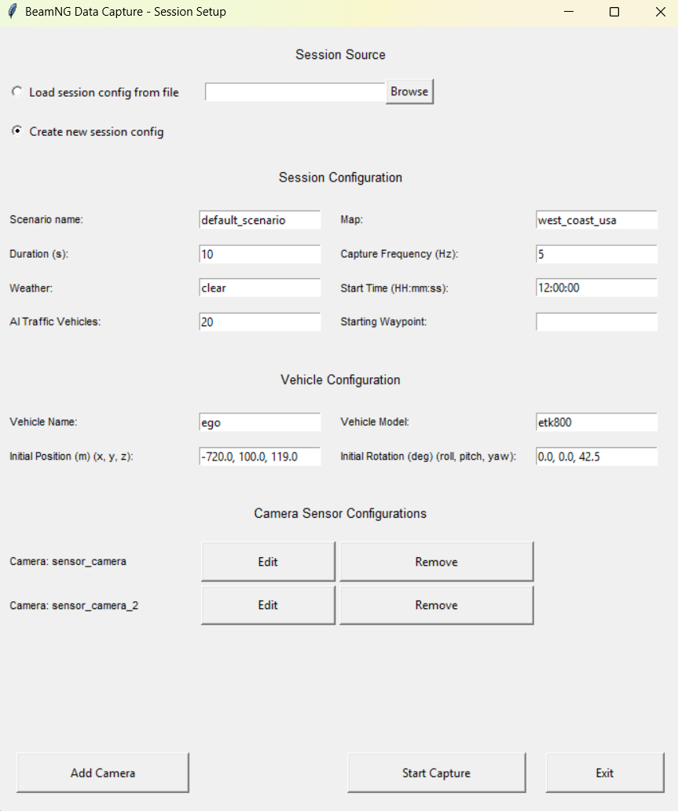
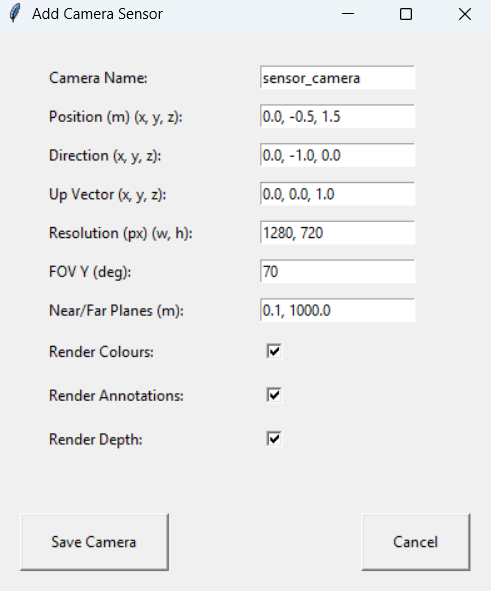

# BeamNG-Data-Capture
This project uses the BeamNG.tech Python API to capture and extract data from a BeamNG instance. It is intended for generating datasets for computer vision models in the field of autonomous driving.

The program can extract color images, depth and semantic annotation data from camera sensors, as well as metadata from the perspective vehicle, its sensors, and the BeamNG instance running the simulation.

The settings of the capture session are defined by a scenario, which can be configured by the user to select the desired perspective vehicle, sensors, map, starting location, etc.

_Note_: A BeamNG.tech license is required for this capture program to work. Regular BeamNG.drive instances are not compatible.

## How to use

### Before launching
Ensure you have both Python and BeamNGpy installed (all project dependencies are listed in the `requirements.txt` file).

```
pip install -r requirements.txt
```

This project has been tested with Python 3.10; earlier versions are not guaranteed to work. It is recommended to use the most recent versions for both BeamNG.tech and BeamNGpy. At the time of development, these were version 0.34 and version 1.31, respectively.

You must set up the `BNG_HOME` environment variable with the BeamNG.tech folder path (for example, `C:\Users\[your_user]\Documents\BeamNG.tech`). Alternatively, set this path as the value for the `beamng_home_path` variable in the `settings.py` file.

### Launching
To execute the program and begin a capture session, open a console in the project root and run:

```
python src/main.py
```

Alternatively, from the `src` folder, you can run:

```
python main.py
```

This will launch a BeamNG.tech instance and start a capture session. By default, the session will use the parameters defined in the `settings.py` file, but the session can be configured using the graphical user interface (GUI) that appears at startup.

### GUI

A graphical user interface (GUI) is provided for configuring capture sessions. The GUI allows the user to either load a session configuration from file or create a new session configuration via form.

**Session Configuration Window:**  


- **Session Source:** Choose to load a session config file or create a new session config.
- **Session Configuration:** Set scenario name, duration (seconds), weather, number of AI traffic vehicles, map, capture frequency (Hz), start time, and (optionally) a starting waypoint.
- **Vehicle Configuration:** Set the vehicle name, model, initial position (x, y, z), and initial rotation (roll, pitch, yaw).
- **Camera Sensor Configurations:** Add one or more cameras to the session. Click "Add Camera" to open the camera configuration form.
- **Buttons:**  
  - *Add Camera*: Add a new camera sensor to the configuration (capped in the GUI to nine).  
  - *Start Capture*: Begin the data capture session with the current settings.
  - *Exit*: Close the GUI and exit the program, without starting a capture session.

**Camera Settings Form:**  


- **Camera Name:** Unique name for the camera sensor.
- **Position (m) (x, y, z):** Camera position (relative to the vehicle).
- **Direction (x, y, z):** Direction vector the camera is facing (relative to the vehicle).
- **Up Vector (x, y, z):** Up direction for the camera (relative to the vehicle).
- **Resolution (px) (w, h):** Image width and height in pixels.
- **FOV Y (deg):** Vertical field of view in degrees.
- **Near/Far Planes (m):** Near and far clipping planes.
- **Render Colours:** Enable/disable color image rendering.
- **Render Annotations:** Enable/disable semantic annotation rendering.
- **Render Depth:** Enable/disable depth image rendering.
- **Actions:**  
  - *Save Camera*: Save the camera configuration and return to the session configuration window.  
  - *Cancel*: Discard changes and return to the main setup window.

Once you have selected a file to load or filled the session configuration form, click on the `Start Capture` button to launch `BeamNG.tech` and begin the capture session.

### Output

Captured images and metadata will be saved in the output directory specified by `output_root_path` in `settings.py`. The output folder will be named with the program start time (following the `YYYY-MM-DD_HH-mm-ss` format) and contain the following files:

- `frame_XXXX_YYYY_color.png`
- `frame_XXXX_YYYY_depth.png`
- `frame_XXXX_YYYY_semantic.png`
- `frames_metadata.json`
- `session_metadata.json`
- `log.txt`

Where `XXXX` is the number of the captured frame and `YYYY` is the name of the corresponding camera. Rendering of color, depth and semantic images can be individually disabled per camera, being ommited from the output.

## Source files description

### Configuration files
Used to define the classes and their corresponding dictionaries for the different configurations used by the program. The data in these configurations can be customized by the user.

<dl>
  <dt><b>camera_sensor_config.py</b></dt>
  <dd>Defines the configuration used for the camera sensors.</dd>
  <dt><b>session_config.py</b></dt>
  <dd>Defines the configuration used for the capture sessions.</dd>
  <dt><b>vehicle_config.py</b></dt>
  <dd>Defines the configuration used for the vehicles.</dd>
</dl>

### Manager files
Used to define functionalities involving calls to the BeamNG.tech Python API.

<dl>
  <dt><b>data_capture_mgr.py</b></dt>
  <dd>Used to handle the data capturing from the simulation and metadata handling.</dd>
  <dt><b>logging_mgr.py</b></dt>
  <dd>Used to manage calls to the BeamNG.tech logging module.</dd>
  <dt><b>scenario_mgr.py</b></dt>
  <dd>Used to manage calls related to BeamNG scenarios and the currently loaded environment.</dd>
  <dt><b>simulation_mgr.py</b></dt>
  <dd>Used to manage calls directed to the BeamNG simulator instance.</dd>
  <dt><b>vehicle_mgr.py</b></dt>
  <dd>Used to manage calls regarding vehicles.</dd>
</dl>

### GUI files
Used to define the GUI functionality, its specific implementation and the API abstraction used to keep them detached.

<dl>
  <dt><b>gui_mgr.py</b></dt>
  <dd>High-level logic for the session configuration GUI, independent of the underlying GUI toolkit.</dd>
  <dt><b>gui_api.py</b></dt>
  <dd>Defines the abstract interface for GUI operations, allowing different GUI frameworks to be used interchangeably.</dd>
  <dt><b>gui_tkinter.py</b></dt>
  <dd>Implements the GUI API using Tkinter. This is the default GUI backend.</dd>
</dl>

### General files
Files that don't fit into any of the previous categories.

<dl>
  <dt><b>main.py</b></dt>
  <dd>Defines the data capture initialization, capture loop and finish.</dd>
  <dt><b>settings.py</b></dt>
  <dd>Defines the variables and configurations used by the program.</dd>
  <dt><b>utils.py</b></dt>
  <dd>Defines generic or utility functions.</dd>
  <dt><b>type_defs.py</b></dt>
  <dd>Contains type definitions and aliases used throughout the project.</dd>
</dl>

### Notes
- Some `py.warnings` may appear at the end of the log (subprocess still running, unclosed file). These are benign warnings that don't affect the capture session and can be safely ignored.
